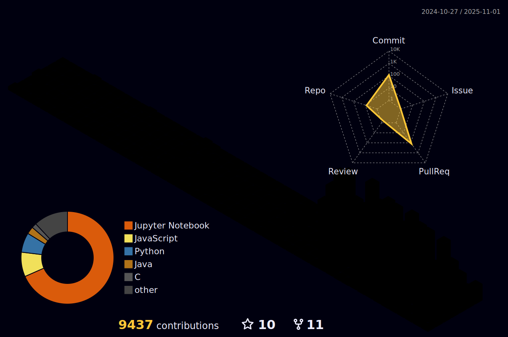

# Hello, I'm Daniel 👋 

🖥️ Computer Scientist | 📍 Bolzano - Verona | [WebSite](https://danielamadori.github.io) | [Linkedin]()

## About Me

- 🎓 **Education:** 
  - M.S. in Computer Science and Engineering (Graduated 07/2025) - University of Verona (Thesis: Explaining Strategies for Expected Impacts)
  - M.S. (Erasmus) in Intelligent Systems and Numerical Applications in Engineering (9/2023 - 2/2024) - University of Las Palmas de Gran Canaria
  - B.S. in Computer Science (Graduated 12/07/2022) - University of Verona (Thesis: A system for contact tracing based on BLE devices)

- 💼 **Work Experience:**
  - (03/2025 - 06/2025) Tutor of Software Engineering - B.S. in Bioinformatics - University of Verona
  - (03/2025 - 06/2025) Tutor of Software Engineering - B.S. in Computer Science - University of Verona
  - (11/2024 - 02/2025) Tutor of Programming II - B.S. in Computer Science - University of Verona 
  - (11/2024 - 02/2025) Tutor of Programming - B.S. in Bioinformatics - University of Verona
  - (10/2024 - 04/2025) Educator - Integrated digital teaching and digital transition education for school staff
  - (04/2024 - 06/2024) Tutor of Software Engineering - B.S. in Bioinformatics - University of Verona
  - (03/2024 - 06/2024) Tutor of Software Engineering - B.S. in Computer Science - University of Verona
  - (03/2024 - 07/2024) Tutor of Programming with laboratory - B.S. in Applied Mathematics - University of Verona
  - (03/2023 - 06/2023) Tutor of Software Engineering - B.S. in Computer Science, Bioinformatics - University of Verona
  - (10/2022 - 02/2023) Tutor of Programming II - B.S. in Computer Science - University of Verona
  - (09/2021 - 08/2022) High School Teacher - ISS Galileo Galilei - ITT - Computer Science

- :gear: **Git statistics:**

    

    

